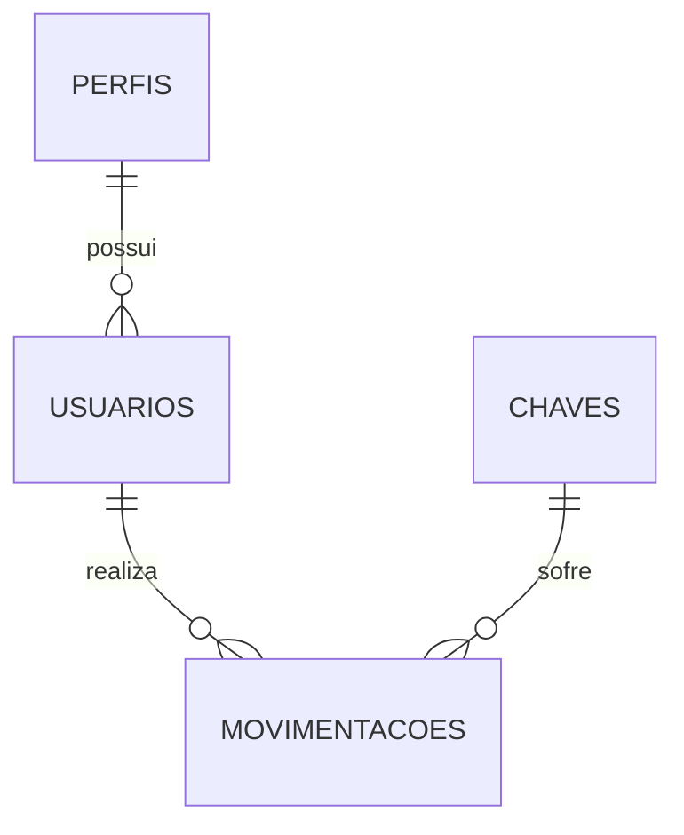

# 🗄️ Estrutura do Banco de Dados - Controle de Chaves

Este documento detalha o esquema do banco de dados MySQL 8.0 para o **Sistema de Controle de Chaves por QR Code**.

## 1. Scripts de Criação do Banco de Dados (DDL)

```sql
CREATE DATABASE IF NOT EXISTS controle_chaves 
DEFAULT CHARACTER SET utf8mb4 COLLATE utf8mb4_unicode_ci;

USE controle_chaves;

-- =========================================================================
-- 1. TABELA DE PERFIS DE ACESSO
-- =========================================================================
CREATE TABLE IF NOT EXISTS perfis (
    id INT AUTO_INCREMENT PRIMARY KEY,
    nome VARCHAR(50) NOT NULL UNIQUE
) ENGINE=InnoDB;

INSERT INTO perfis (id, nome) VALUES 
(1, 'Administrador'), 
(2, 'Estagiário'), 
(3, 'Docente'), 
(4, 'TAE'),
(5, 'Limpeza'),
(6, 'Segurança'),
(7, 'Externo'),
(8, 'Aluno')
ON DUPLICATE KEY UPDATE nome=VALUES(nome);

-- =========================================================================
-- 2. TABELA DE USUÁRIOS
-- =========================================================================
CREATE TABLE IF NOT EXISTS usuarios (
    id INT AUTO_INCREMENT PRIMARY KEY,
    nome VARCHAR(100) NOT NULL,
    email VARCHAR(100) UNIQUE,
    matricula VARCHAR(50) NOT NULL UNIQUE,
    perfil_id INT NOT NULL,
    qr_code_hash VARCHAR(64) NOT NULL UNIQUE,
    senha_hash VARCHAR(255) NULL,
    ativo BOOLEAN DEFAULT TRUE,
    criado_em TIMESTAMP DEFAULT CURRENT_TIMESTAMP,
    FOREIGN KEY (perfil_id) REFERENCES perfis(id)
) ENGINE=InnoDB;

-- =========================================================================
-- 3. TABELA DE CHAVES (Salas/Ambientes)
-- =========================================================================
CREATE TABLE IF NOT EXISTS chaves (
    id INT AUTO_INCREMENT PRIMARY KEY,
    nome_sala VARCHAR(100) NOT NULL,
    codigo_sala VARCHAR(20) NOT NULL UNIQUE,
    qr_code_hash VARCHAR(64) NOT NULL UNIQUE,
    status_disponivel BOOLEAN DEFAULT TRUE,
    descricao TEXT NULL,
    criado_em TIMESTAMP DEFAULT CURRENT_TIMESTAMP
) ENGINE=InnoDB;

-- =========================================================================
-- 4. TABELA DE MOVIMENTAÇÕES (Histórico de Retirada/Devolução)
-- =========================================================================
CREATE TABLE IF NOT EXISTS movimentacoes (
    id INT AUTO_INCREMENT PRIMARY KEY,
    usuario_id INT NOT NULL,
    chave_id INT NOT NULL,
    data_retirada DATETIME DEFAULT CURRENT_TIMESTAMP,
    data_devolucao DATETIME NULL,
    observacao TEXT NULL,
    FOREIGN KEY (usuario_id) REFERENCES usuarios(id),
    FOREIGN KEY (chave_id) REFERENCES chaves(id),
    INDEX idx_chave_devolucao (chave_id, data_devolucao),
    INDEX idx_usuario (usuario_id)
) ENGINE=InnoDB;
```

---

## 2. Dicionário de Dados & Relacionamentos



### `perfis`
Define o nível de privilégio e a categoria do usuário no sistema.
- `id`: Chave primária auto-incrementada.
- `nome`: Nome único do perfil (ex: Administrador, Professor).

### `usuarios`
Cadastro dos servidores, professores e técnicos autorizados a retirar chaves.
- `qr_code_hash`: Hash SHA-256 codificado no QR Code do crachá do usuário para identificação veloz.
- `senha_hash`: Utilizada apenas pelos administradores para acesso ao painel de gerenciamento.

### `chaves`
Cadastro de cada chave física gerenciada pelo sistema.
- `codigo_sala`: Identificador visual e curto da sala (ex: `LAB-01`, `SALA-12`).
- `qr_code_hash`: Hash SHA-256 colado no chaveiro físico.
- `status_disponivel`: Flag booleana que indica se a chave está na portaria (`TRUE`) ou se foi retirada (`FALSE`).

### `movimentacoes`
Tabela pivot que registra o fluxo histórico de retiradas e devoluções.
- `data_devolucao`: Permanece `NULL` enquanto a chave estiver em uso (retirada). Preenchida no momento do escaneamento de devolução.
- **Índices Otimizados:**
  - `idx_chave_devolucao (chave_id, data_devolucao)`: Acelera a verificação rápida de qual movimentação está em aberto para uma chave que acabou de ser escaneada para devolução.
